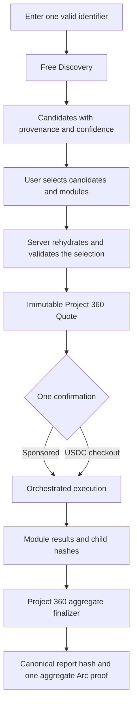

# P4.2 — Veyra Project 360 Due Diligence

Status: design reviewed, approved for implementation
Schema version: `veyra.project360.v1`
Scope: free discovery, immutable quote, orchestrated execution, aggregate report and Arc proof

## 1. Product contract

Project 360 is an orchestrator over five existing or narrowly extended Veyra modules:

1. GitHub Due Diligence
2. Agent Trust Report
3. Treasury Health
4. Paid API Quality
5. Arc Contract Analysis

A project may start with any one explicitly supplied valid identifier:

- GitHub repository;
- project wallet;
- Agent ID;
- Arc contract;
- public HTTPS API endpoint.

The workflow has three deliberately separate stages:

1. **Discovery (free):** inspect the primary source, find possible additional sources and store evidence of where each candidate came from.
2. **Quote (immutable):** the user explicitly selects candidates and modules, then receives a line-item quote with expected coverage and limitations.
3. **Execution (paid or sponsored):** one confirmation runs the quoted module plan, tolerates individual module failures and produces one aggregate report.

Discovery never authorizes a paid module. Every discovered candidate is unchecked by default. A browser checkbox is only a proposal until the server creates an immutable quote from candidate IDs and a discovery revision.

## 2. User flow



The UI must keep the following boundaries visible:

- Discovery is labelled **Free** and has no checkout action.
- Candidates display type, canonical value, file and line, confidence, and an unchecked Include checkbox.
- The quote displays each selected module, each module cost, the aggregate-finalization line item, platform fee, total, expected coverage and incomplete-data warnings.
- The confirmation screen never contains a hidden module or an undisclosed provider purchase.
- Progress is reported per module; one failed module does not hide successful results.

## 3. Architecture

### 3.1 Discovery plane

The discovery plane is a deterministic, bounded, read-only service. It has no access to checkout or hosted-payer capabilities.

For a GitHub primary source, it reads only public GitHub content from fixed GitHub API hosts. It prioritizes:

1. root README files;
2. package and dependency manifests;
3. deployment and application configuration;
4. documentation;
5. a bounded selection of source files.

Initial limits:

- at most 40 files;
- at most 64 KiB per file;
- at most 512 KiB total decoded content;
- at most 15 seconds wall-clock discovery time;
- no recursive traversal into related repositories;
- no authenticated call to a discovered endpoint;
- no payment, contract write, wallet signing or provider purchase.

Candidate detectors find:

- canonical GitHub repository references;
- EVM addresses, subsequently classified by a read-only Arc bytecode lookup as wallet or contract;
- Veyra Agent IDs;
- public HTTPS endpoints.

The detector records a redacted single-line provenance excerpt only when it is demonstrably free of credentials and token-like material. Raw files and raw endpoint responses are not persisted.

For non-GitHub primary identifiers, Discovery validates and records the primary identifier. It may derive only high-confidence candidates from already available public Veyra records. It does not probe arbitrary web pages or expand the trust boundary in P4.2.

### 3.2 Quote plane

The quote plane receives:

- a ready, unexpired discovery public ID;
- the discovery revision;
- selected candidate public IDs;
- selected modules;
- a request idempotency key.

It does **not** accept candidate values. The server loads candidate rows, verifies ownership, revision, candidate-set hash and validation status, then creates a normalized confirmed-source snapshot.

The existing hosted workflow quote remains the source of truth for:

- immutable normalized input hash;
- selected services and fixed price snapshots;
- provider subtotal, platform fee and total;
- sponsored-versus-paid authorization;
- quote expiry;
- checkout idempotency.

A Project 360 quote extension binds the hosted quote to the exact discovery and source selection.

### 3.3 Execution plane

Execution uses only the quote snapshot. Client-supplied identifiers are ignored after quote creation.

The orchestrator builds a deterministic module dependency graph rather than allowing a generic planner to reorder services by price. Shared evidence is purchased or collected once. For example, GitHub evidence can serve both GitHub Due Diligence and Agent Trust without a duplicate GitHub provider charge.

Each selected module writes an idempotent module-run record. Completed modules are reused on a replay. A failure is sanitized, recorded, and execution proceeds to independent modules. The aggregate finalizer always runs when at least one module completed successfully.

The hosted payer, x402 settlement, provider receipt and proof paths remain unchanged. The Project 360 aggregate proof is additional report-level evidence, not a replacement for operational child receipts and proofs.

### 3.4 Module adapters

| Module | Required source | Reused capability | P4.2 behavior |
|---|---|---|---|
| GitHub Due Diligence | GitHub repository | Existing GitHub intelligence and analysis | Produces the existing repository assessment and score |
| Agent Trust Report | Agent ID; optional repository, wallet, contract, endpoint | Existing Agent Trust snapshots and finalizer | Uses confirmed sources only; absent optional evidence is unknown, not negative |
| Treasury Health | Project wallet | Existing Treasury Health finalizer | Read-only Arc balance/activity evidence |
| Paid API Quality | Public API endpoint | Existing API Quality observations/finalizer | Full score only for a matching public Veyra service; otherwise availability-only with insufficient scoring evidence |
| Arc Contract Analysis | Arc contract | Existing Agent Trust contract snapshot plus a narrow finalizer | Testnet bytecode, proxy/admin/owner/paused signals; no audit claim |

An arbitrary public endpoint is never represented as having payment or settlement quality merely because it responded. Availability-only evidence returns `score: null`, `confidence: insufficient` and is excluded from the Project Trust Score.

## 4. Storage model

All tables use service-role access for server workflows, deny anonymous access with RLS, and are resolved through owner wallet or machine credential isolation.

### 4.1 `project_360_discoveries`

| Column | Purpose |
|---|---|
| `id uuid` | Internal primary key |
| `public_id text` | Non-sequential `dsc_...` identifier |
| `owner_wallet text` | Browser tenant boundary |
| `machine_credential_id uuid null` | Machine tenant boundary |
| `status text` | Discovery state |
| `revision integer` | Candidate-set revision, initially 1 |
| `primary_type text` | Canonical source type |
| `primary_value text` | Canonical, public-safe value |
| `primary_value_hash text` | Hash used in request binding |
| `idempotency_hash text` | Hashed idempotency key |
| `request_hash text` | Normalized discovery request hash |
| `candidates_hash text null` | Hash of the ordered candidate set |
| `warnings jsonb` | Public-safe reason codes only |
| `error_code text null` | Sanitized stable error code |
| `expires_at timestamptz` | Discovery validity window |
| timestamps | Created, started and completed times |

Uniqueness is enforced for `public_id` and for the tenant/idempotency tuple. Reusing a key with a different request returns an idempotency conflict.

### 4.2 `project_360_candidates`

| Column | Purpose |
|---|---|
| `id uuid` / `public_id text` | Internal and public `src_...` IDs |
| `discovery_id uuid` | Parent discovery |
| `source_type text` | One of the five source types |
| `module text` | Module enabled by this source |
| `canonical_value text` | Normalized public value |
| `value_hash text` | Hash used in immutable selection |
| `origin_kind text` | `primary`, `github_file`, or `public_record` |
| `origin_repository text null` | Canonical repository |
| `file_path text null` | Repository-relative safe path |
| `line_start/end integer null` | 1-based provenance lines |
| `safe_excerpt text null` | Redacted, length-bounded evidence |
| `confidence text` | `high`, `medium`, or `low` |
| `confidence_score numeric` | Deterministic 0..1 score |
| `reason_code text` | Stable explanation for confidence |
| `validation_status text` | `valid`, `unsupported`, or `blocked` |
| timestamps | Creation and validation time |

Duplicate detector hits are collapsed by discovery, source type, value hash and provenance fingerprint. The API never emits internal IDs or tenant fields.

The explicitly provided primary source is stored as a high-confidence candidate with `origin_kind: primary`. It is visually distinguished from discovered candidates. It still does not authorize unrelated modules.

### 4.3 `project_360_quotes`

| Column | Purpose |
|---|---|
| `quote_id uuid unique` | Foreign key to hosted workflow quote |
| `discovery_id uuid` | Bound discovery |
| `discovery_revision integer` | Prevents stale selection |
| `candidates_hash text` | Binds the whole visible candidate set |
| `selection_hash text` | Binds selected candidate IDs and modules |
| `selected_candidate_ids jsonb` | Ordered public IDs |
| `confirmed_sources jsonb` | Server-generated normalized snapshot |
| `module_price_snapshot jsonb` | Line items and fixed prices |
| `expected_coverage_count integer` | Selected modules out of five |
| `warnings jsonb` | Incomplete-data warnings |
| timestamps | Creation and expiry context |

### 4.4 `project_360_module_runs`

| Column | Purpose |
|---|---|
| `job_id uuid` / `module text` | Unique execution-module pair |
| `status text` | Module execution state |
| `input_hash text` | Confirmed module-input hash |
| `attempt_count integer` | Controlled retries |
| `child_report_hash text null` | Canonical child result hash |
| `score integer null` | Module score when supported |
| `confidence text` | Evidence confidence |
| `result_snapshot jsonb null` | Public-safe normalized result |
| `error_code text null` | Stable sanitized category |
| timestamps | Start, completion and retry times |

The unique `(job_id, module)` constraint and compare-and-set state transitions prevent a replay from executing or charging a completed module twice.

## 5. States and idempotency

### 5.1 Discovery states

`queued → running → ready`

Terminal alternatives are `failed` and `expired`. A ready discovery becomes unusable after expiry; a new discovery is required rather than silently refreshing sources behind an existing quote.

The same tenant, idempotency key and normalized request returns the original discovery. The same key with a different primary source returns `409 idempotency_conflict`.

### 5.2 Quote states

Project 360 uses the existing quote lifecycle. Quote creation requires:

- `discovery.status = ready`;
- discovery not expired;
- exact current revision and candidate-set hash;
- every selected candidate belongs to this discovery and tenant;
- every selected module has a confirmed valid source;
- at least one module selected.

The selection hash is computed from a versioned, sorted list of candidate public IDs, value hashes and modules. Replays return the same quote. Changed selections require a different idempotency key.

### 5.3 Module states

Each module is one of:

- `not_provided` — no confirmed source;
- `not_selected` — source exists but user excluded the module;
- `pending`;
- `running`;
- `completed`;
- `failed`;
- `unsupported` — valid source, but available evidence cannot run the requested analysis.

Only `pending` may transition to `running`. A retry may move a retryable `failed` record back to `running` under a bounded policy. `completed` is immutable.

### 5.4 Job replay

The existing quote confirmation and Machine API idempotency contracts remain authoritative. A repeated confirmation or run request returns the same job/report. It does not create a second user payment, provider payment, module result or aggregate proof publication request.

## 6. Discovery confidence

Candidate confidence describes the likelihood that a discovered value is a project source, not whether that source is trustworthy.

| Confidence | Score | Examples |
|---|---:|---|
| High | 0.90–1.00 | Explicit primary input; named `contractAddress`; documented official API base URL |
| Medium | 0.65–0.89 | README link in a deployment/integration section; address next to an Arc network label |
| Low | 0.40–0.64 | Unlabelled literal in source or documentation |

Values below 0.40 are not shown. Confidence never selects a checkbox and never changes price without a user selection.

## 7. Transparent quote and costs

Prices are derived from immutable service-registry snapshots, never duplicated in client logic. The initial execution plan exposes these provider line items:

| Module/line item | Initial provider cost |
|---|---:|
| GitHub Due Diligence | 0.0020 USDC |
| Agent Trust Report finalization | 0.0001 USDC |
| Treasury Health | 0.0025 USDC |
| Paid API Quality | 0.0020 USDC |
| Arc Contract Analysis | 0.0005 USDC |
| Project 360 canonical finalization | 0.0001 USDC |

The quote response and UI show:

- the selected modules;
- service-backed cost of every module;
- shared-evidence savings where relevant;
- Project 360 canonical finalization as its own visible line;
- provider subtotal;
- platform fee;
- total user price;
- `expectedCoverage: selectedModuleCount / 5`;
- warnings for missing or insufficient inputs.

The finalization line is included whenever at least one module is selected. It is not hidden inside the platform fee. Registry price drift cannot alter an existing quote.

## 8. Coverage and completion status

Coverage and score are independent.

- **Expected coverage:** selected modules / 5.
- **Actual coverage:** successfully completed modules / 5.
- **Complete coverage:** all five modules completed successfully.
- **Partial coverage:** fewer than five modules selected and every selected module completed successfully.
- **Limited coverage:** at least one selected module failed or was unsupported, while at least one module completed. The UI label is **Completed with limited coverage**.
- **Failed:** no selected module completed.

Missing, unselected, unsupported and failed modules never become zero scores and never automatically create a negative risk. They appear in limitations with their exact status.

A GitHub-only run therefore displays:

- `Coverage: 1 of 5 modules`;
- `Partial Project 360 Report`;
- four module cards marked `Not provided` or `Not analyzed`;
- an `Add data source` action.

## 9. Project Trust Score and report confidence

The version-1 module weights are:

| Module | Weight |
|---|---:|
| GitHub Due Diligence | 25 |
| Agent Trust Report | 25 |
| Treasury Health | 20 |
| Paid API Quality | 15 |
| Arc Contract Analysis | 15 |

Let `S` be modules that completed and produced a numeric score. The Project Trust Score is:

```text
round(sum(weight[module] × score[module]) / sum(weight[module])) for module in S
```

No score is emitted when `S` is empty. Missing and failed modules are excluded rather than assigned zero. Cross-module identity conflicts are disclosed as risks but do not apply an undisclosed score penalty in version 1.

Evidence confidence factors are:

- high = 1.00;
- medium = 0.75;
- low = 0.50;
- insufficient = 0.00.

```text
evidenceConfidence =
  sum(weight[module] × confidenceFactor[module]) / sum(weight[module]) for module in S

projectConfidencePercent =
  round(evidenceConfidence × actualCoverageRatio × 100)
```

Confidence labels are high at 80 or above, medium at 50–79, low at 1–49 and insufficient at 0. This deliberately prevents weak or narrow evidence from looking like a full-project conclusion without treating uncertainty as a trust failure.

## 10. Fifteen sections of the final report

Every report has the same ordered section model. Sections without evidence retain an explicit non-negative state.

1. **Executive Summary and Verdict** — score, confidence, coverage and plain-language verdict.
2. **Confirmed Project Identity** — only explicitly entered or selected canonical sources.
3. **Coverage and Confidence** — expected/actual module coverage and confidence calculation.
4. **GitHub Due Diligence** — repository signals or `Not provided / Not analyzed`.
5. **Agent Trust** — agent status and linked evidence.
6. **Treasury Health** — wallet health and limitations.
7. **Paid API Quality** — observed availability/payment quality, never inferred quality.
8. **Arc Contract Analysis** — code/proxy/admin/owner/paused signals and testnet disclaimer.
9. **Identity Consistency** — cross-module agreements and conflicts.
10. **Project Trust Score** — weighted breakdown and formula version.
11. **Evidence Matrix** — signal, source, module, confidence and evidence hash.
12. **Evidence-backed Strengths** — strengths supported by successful modules.
13. **Risks and Review Items** — evidence-backed risks and manual checks.
14. **Limitations and Module Status** — missing, unselected, failed and unsupported modules.
15. **Receipts and Arc Verification** — child report hashes, aggregate hash, receipts and aggregate Arc proof status.

## 11. Failure isolation and retries

Module adapters return a normalized envelope:

```json
{
  "module": "treasury_health",
  "status": "completed",
  "score": 72,
  "confidence": "medium",
  "reportHash": "0x...",
  "error": null
}
```

Errors are classified as `invalid_input`, `source_unavailable`, `timeout`, `provider_failure`, `payment_failure`, `verification_delay`, `unsupported` or `internal_error`. Public responses contain only the stable code, retryability and a safe message.

Rules:

- input errors discovered before quote creation prevent that module from being selected;
- a module timeout or provider error marks only that module failed;
- payment failures are never represented as a completed module;
- deterministic child output remains acceptable when optional LLM synthesis fails;
- the aggregate finalizer runs after all independent modules settle when at least one succeeded;
- retryable failures use bounded attempts and reuse the module-run idempotency record;
- a retry cannot add a module or exceed the quoted amount;
- a zero-success run has no Project Trust Score and no successful report claim.

## 12. Canonical payload and aggregate Arc proof

The aggregate report hash covers a deterministic public-safe payload:

```json
{
  "schema": "veyra.project360.v1",
  "reportId": "p360_...",
  "workflow": "project_360",
  "confirmedSources": [
    {
      "type": "github_repository",
      "canonicalValue": "owner/repository",
      "valueHash": "...",
      "origin": "primary"
    }
  ],
  "discoverySnapshotHash": "...",
  "selectionHash": "...",
  "modules": [
    {
      "module": "github_due_diligence",
      "status": "completed",
      "inputHash": "...",
      "childReportHash": "...",
      "score": 78,
      "confidence": "high",
      "errorCode": null
    }
  ],
  "score": {
    "formulaVersion": "project360-score-v1",
    "value": 78,
    "confidencePercent": 20
  },
  "coverage": {
    "expected": 1,
    "completed": 1,
    "total": 5,
    "status": "partial"
  },
  "sections": [],
  "evidenceMatrix": [],
  "limitations": [],
  "generatedAt": "2026-08-01T00:00:00.000Z"
}
```

Arrays use fixed module and section order; object keys are canonically serialized. Evidence is normalized and hashed. The payload excludes:

- owner wallet;
- machine credential ID;
- database IDs;
- quote, job and payment internals;
- authorization data and secrets;
- raw provider payloads and raw errors.

The Project 360 aggregate finalizer independently verifies the selection hash, child hashes, score formula, coverage and canonical payload hash. It returns the canonical hash through the existing trusted response-hash header. The existing Arc proof registry publishes and verifies that exact report hash.

Arc testnet has deterministic finality: a transaction is final once included, so the existing one-receipt confirmation path remains sufficient. No network, registry address, custody rule or contract behavior changes in P4.2.

The report-level `verifiedOnArc` flag is true only for the aggregate hash. Child provider proofs remain visible as operational receipts but cannot upgrade an unverified aggregate report.

## 13. Security model

### 13.1 SSRF and untrusted content

- GitHub discovery calls only fixed official GitHub API hosts.
- Public endpoints must be HTTPS, contain no userinfo and pass the existing private/reserved-address checks.
- DNS is checked when confirming a candidate, then resolved again at execution.
- Execution uses DNS-pinned requests, redirects disabled, an 8-second timeout and a 64 KiB response cap.
- No authorization header, cookie or discovered credential is sent.
- URL query and fragment values are removed from canonical endpoint candidates.
- Endpoint bodies are not stored by Discovery.
- Arc RPC is fixed by server configuration and must report the expected Arc testnet chain ID.
- Repository files are treated as hostile text, never executed, imported or used to construct shell commands.

### 13.2 Secret detection

Lines containing token, key, secret, password, bearer, private-key or high-entropy credential patterns do not produce a stored excerpt. URLs with credential-like query data are rejected rather than redacted into a selectable candidate. Logs receive hashes and stable reason codes, not raw content.

### 13.3 No hidden charges

- Discovery code cannot invoke x402 or checkout code.
- Every discovered candidate begins excluded.
- Every paid service has a visible immutable quote line.
- Shared evidence is charged once.
- Platform fee and total are explicit.
- Execution cannot add services or raise budget after confirmation.
- A failed module cannot trigger an unquoted fallback provider.

### 13.4 No source substitution

- The client submits candidate IDs, not replacement values.
- The server binds discovery revision, complete candidate-set hash, selection hash and normalized value hashes.
- Quote execution reads confirmed sources only from the immutable quote extension.
- A changed or expired discovery is rejected instead of silently refreshed.
- DNS changes can fail an endpoint module but cannot redirect it to another host.
- Canonical GitHub identity removes URL-path variants such as `/tree/main` before hashing.

### 13.5 Tenant isolation and privacy

Browser access is scoped to the connected owner wallet. Machine access is scoped to the issuing credential. Cross-tenant discovery and quote lookups return the same not-found response. Public reports expose only confirmed public-safe sources and aggregate evidence; they never expose ownership, credential, cron, quote or payment fields.

## 14. APIs and UI boundaries

Browser routes:

- `POST /api/project-360/discoveries`
- `GET /api/project-360/discoveries/[publicId]`
- `POST /api/project-360/discoveries/[publicId]/quote`
- existing hosted quote confirmation, job and report routes

Machine routes:

- `POST /api/agent/v1/project-360/discoveries`
- `GET /api/agent/v1/project-360/discoveries/[publicId]`
- Project 360 quote creation under the existing `quotes:create` scope
- existing `runs:create`, `runs:read` and `reports:read` scopes

Discovery does not require a new spending scope because it is free. Machine quote creation still requires `quotes:create`; no execution occurs without `runs:create` and the normal confirmation contract.

The workflow UI sequence is:

1. Choose Project 360.
2. Enter one primary identifier.
3. Run Free Discovery.
4. Review provenance and explicitly include candidates.
5. Review the line-item quote and expected coverage.
6. Confirm once through sponsored authorization or USDC checkout.
7. Follow per-module progress.
8. Read and share the aggregate report and Arc proof.

## 15. Observability

Metrics use source/module types and stable error codes, never canonical values:

- discovery latency, files and bytes scanned;
- candidates detected/accepted/rejected by type and confidence;
- quote expected coverage and selected module count;
- module latency, retries and outcome;
- provider and payment failure counts;
- aggregate finalization failures;
- Arc verification delay;
- replay hits and idempotency conflicts.

Structured logs include discovery public ID, quote public ID, job public ID and hashes only where required for correlation. They exclude source excerpts, endpoints, wallets, credentials and raw responses.

## 16. Design review

Review date: 2026-08-01

| Requirement/invariant | Result | Resolution |
|---|---|---|
| One valid identifier is enough | Pass | Primary source creates one eligible module |
| Discovery is free | Pass | Discovery plane has no payment/hosted-payer dependency |
| Candidates never auto-run | Pass | Candidates default excluded; server accepts IDs only during quote creation |
| File and line provenance | Pass | Candidate schema and bounded GitHub scanner retain safe line provenance |
| Transparent pricing | Pass | All module and aggregate-finalizer costs are visible immutable line items |
| Partial report is not called complete | Pass | Coverage and completion status are independent and explicit |
| Unknown data does not reduce score | Pass | Only successful numeric modules participate in the weighted score |
| One module may fail independently | Pass | Idempotent per-module state and aggregate limited-coverage status |
| Exactly one report-level Arc proof | Pass | Aggregate finalizer binds source selection, module states and child hashes |
| Existing child proof invariant | Pass | Provider receipts/proofs remain operational evidence, distinct from aggregate verification |
| SSRF protection | Pass | Fixed GitHub host, HTTPS validation, DNS recheck/pinning, no redirects and strict limits |
| No source substitution | Pass | Discovery revision, candidate hash, selection hash and quote snapshot are bound |
| No hidden charge | Pass | No discovery checkout, visible finalizer, no runtime service expansion |
| Browser and Machine tenant isolation | Pass | Owner/credential-scoped lookup with fail-closed not-found behavior |
| Deterministic fallback | Pass | Optional synthesis failure does not invalidate deterministic module evidence |
| Arc testnet-only boundary | Pass | Existing configured proof path is reused; no mainnet/audit claim |

Two implementation risks were resolved during review:

1. **Full execution exceeds the generic three-call plan limit.** Project 360 receives an explicit deterministic plan and a workflow-specific maximum of seven visible service calls. It cannot use the generic price-sorted planner.
2. **An arbitrary endpoint lacks paid-API history.** It receives availability-only evidence with no numeric module score. The report states insufficient evidence instead of manufacturing API quality or revenue signals.

## 17. Implementation acceptance criteria

- A primary GitHub identifier produces a free, bounded discovery with persisted file/line candidates.
- All discovered candidates are returned with `included: false`.
- Candidate values cannot be replaced by the quote request.
- A GitHub-only quote shows one of five expected modules and every price line.
- A full quote includes all five modules plus visible aggregate finalization and fits the workflow-specific call budget.
- Replaying discovery, quote or execution with the same idempotency input returns the same resource.
- Reusing an idempotency key with changed input returns a conflict.
- Missing evidence never becomes score zero or a negative risk.
- At least one successful module plus one failed module produces `completed_with_limited_coverage`.
- The final report has exactly the fifteen ordered sections defined above.
- The Project Trust Score and confidence match the versioned formulas.
- The canonical hash changes when any confirmed source, module status or child hash changes.
- Aggregate Arc verification applies to the aggregate report hash, not a child payload.
- Private, loopback, link-local, reserved and DNS-rebinding endpoints are blocked.
- Cross-tenant discovery, quote, run and report reads fail closed.
- Logs and API responses contain no secret, owner, credential, raw provider or payment internals.
- Unit, integration, migration, type, lint and production-verification coverage is added before deployment.

## 18. Out of scope

- automatically selecting or charging discovered sources;
- recursive discovery across related repositories;
- authenticated/private repository or endpoint scanning;
- arbitrary API contract testing with user-provided secrets;
- background continuous discovery;
- social reputation or subscription pricing;
- Arc mainnet or audited-contract claims.
